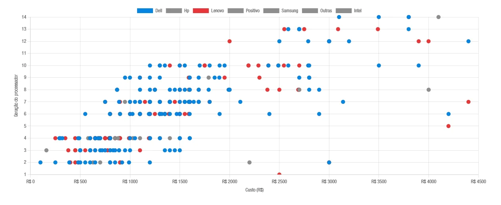

# OLX Monitor

Scraper + extrator de specs para achar **Dell OptiPlex / Lenovo ThinkCentre**
usados na OLX, com busca web e API REST.



## Pipeline

```
fetch (httpx, 1 req/s) → parse (BeautifulSoup/JSON-LD) → banco (SQLite)
    → extração de specs (regex + DeepSeek V4 Flash) → API REST + UI web
```

- Listagem: seletores `olx-adcard-*` · detalhe: JSON-LD `Product` (descrição, imagens, preço)
- Specs: regex resolve RAM/storage/CPU/marca/modelo/formato; a **DeepSeek V4 Flash**
  preenche o resto com saída JSON estruturada (`json_schema`), thinking desligado
- Custo real medido: **~US$0.00016/anúncio** (cache hit ~70%)

## Setup

Requer Python 3.13+ e [uv](https://docs.astral.sh/uv/).

```bash
uv sync                     # instala dependências
cp .env.example .env        # edite DEEPSEEK_KEY (obrigatório p/ extração)
uv run flask db upgrade     # cria o banco (migrações)
```

## Uso

```bash
# 1) Coletar listagem + detalhes (descrição/imagens) de uma busca
uv run flask scrape "dell optiplex sff" --region estado-sp --max-pages 3

# 2) Enriquecer anúncios antigos sem descrição (ex.: coletados com --no-details)
uv run flask enrich [--limit N]

# 3) Extrair specs (regex + LLM) dos anúncios pendentes
uv run flask process [--limit N] [--ad <id> --force]

# 4) Subir a interface
uv run flask run            # → http://localhost:5000
```

### API

| rota | descrição |
|------|-----------|
| `GET /api/ads` | listar/filtrar/ordenar/paginar (`q, brand, cpu_family, ram_min, storage_min, price_min, price_max, form_factor, has_specs, confidence_min, sort, page, per_page`) |
| `GET /api/ads/<id>` | anúncio + specs + imagens + descrição crua |
| `GET /api/stats` | totais, faixa de preço, contagem por `cpu_family` |

Ex.: `GET /api/ads?cpu_family=i5&ram_min=8&price_max=80000&sort=price_asc`

### UI

- `/` — listagem com filtros e paginação
- `/ads/<id>` — detalhe (galeria, specs, descrição crua, link OLX)
- `/chart` — gráfico de dispersão **preço × geração** (Chart.js, cor por marca,
  clique abre o anúncio)
- `/offers` — **análise de compra**: benchmark de preço por geração (p25/p50/p75)
  + ranking de ofertas por desconto vs mediana do mercado, com alertas de
  peças/sucata e valores fora da faixa
- `/review` — anúncios sem specs ou com confiança baixa (< 60%)

## Configuração (`.env`)

| variável | default | descrição |
|----------|---------|-----------|
| `DATABASE_URL` | `sqlite:///instance/olx.db` | conexão SQLite |
| `USER_AGENT` | Chrome | user-agent do scraping |
| `SCRAPER_DELAY` | `1.0` | segundos entre requests |
| `SCRAPER_MAX_PAGES` | `5` | páginas de listagem por execução |
| `DEEPSEEK_KEY` | — | chave da API DeepSeek |
| `DEEPSEEK_MODEL` | `deepseek-v4-flash` | modelo |
| `LLM_MAX_CHARS` | `1500` | truncamento da descrição |
| `LLM_REASONING_EFFORT` | `none` | thinking mode |

## Estrutura

```
app/
├── blueprints/   # api (REST) e main (UI)
├── cli.py        # flask scrape / enrich / process
├── extractors/   # schema (pydantic), regex, llm (DeepSeek), pipeline
├── models/       # Ad, AdImage, AdSpec
├── scrapers/     # client (httpx/rate-limit), olx, dates
└── services/     # ad_service (upsert, filtros, stats)
docs/             # specs/ (decisões e design) + wiki/ (OKF)
tests/            # testes offline (fixtures de HTML reais)
```

## Testes

```bash
uv run pytest
```

Testes são offline (sem rede): scraping/extração usam fixtures de HTML reais
salvas em `tests/fixtures/`; LLM usa transporte mock.
